# Deblur & Denoise su KaoKore come problema inverso — Report

Le sezioni di setup (dataset, operatore di degradazione, metriche) sono riassunte qui in
forma sintetica; la spiegazione teorica completa di ogni scelta è documentata a parte per
la preparazione dell'orale.

## 1. Setup sperimentale

- Dataset: KaoKore v1.3, split ufficiale (train 7405 / dev 926 / test 926). Per vincoli di
  tempo, tuning e valutazione usano un sottoinsieme fisso e deterministico di quello split
  ufficiale: 80 immagini test, 20 dev, identiche per tutti i metodi; il training usa 700-1000
  immagini invece delle 7405 disponibili. Limite dichiarato esplicitamente, non nascosto nei
  numeri.
- Immagini normalizzate in [0,1], RGB (float); il blur è applicato in modo indipendente sui 3
  canali colore (non li mescola, coerente con il fatto che sia un fenomeno fisico per-canale).
- Blur: kernel gaussiano 9x9, sigma=2, condizioni al contorno circolari (periodiche). Questa
  scelta rende l'operatore A e il suo aggiunto A^T esatti (non approssimati) e diagonalizzabili
  via FFT — dettaglio che conta per la correttezza di FISTA e PD-Net, entrambi basati sul
  gradiente del data-fidelity.
- Rumore: gaussiano additivo i.i.d., con deviazione standard pari al noise level sulla scala
  [0,1] (0.005, 0.01, 0.05, 0.1), applicato per-pixel e per-canale. L'osservazione viene salvata
  come PNG a 8 bit (quantizzazione, come farebbe un sensore reale) e riusata identica da tutti
  i metodi — è la garanzia pratica del requisito "stessi input degradati per ogni metodo".
- Metriche: PSNR (data_range=1) e SSIM su RGB, calcolata con skimage (channel_axis=2): media
  dell'indice SSIM sui 3 canali colore, calcolati indipendentemente.
- Baseline (osservazione degradata, prima di ogni ricostruzione), utile per misurare quanto
  guadagna ciascun metodo:

| noise level | PSNR baseline (dB) | SSIM baseline |
|---|---|---|
| 0.005 | 29.86 | 0.843 |
| 0.01  | 29.81 | 0.840 |
| 0.05  | 26.68 | 0.592 |
| 0.1   | 21.57 | 0.297 |

## 2. Metodo variazionale — FISTA + regolarizzazione wavelet

### Formulazione
Il problema è formulato come:

x* = argmin_x  1/2 ||Ax - y||^2 + lambda * ||Wx||_1

con A l'operatore di blur gaussiano e W una trasformata wavelet ortogonale (Daubechies db4,
3 livelli di decomposizione, modalità di bordo "periodization" per preservare l'ortogonalità
coerentemente con le condizioni al contorno circolari di A). Poiché W è ortogonale, le
formulazioni "analysis" e "synthesis" del problema coincidono, e questo è ciò che rende il
prossimale della norma L1 esattamente il soft-thresholding dei coefficienti wavelet, non solo
un'euristica plausibile.

Risolto con FISTA (Beck & Teboulle, 2009): ad ogni iterazione un passo di gradiente sul termine
di data-fidelity con passo 1/L (L=1, costante di Lipschitz esatta grazie alle condizioni al
contorno circolari che rendono l'operatore di blur circolante con massimo autovalore pari a 1 —
kernel normalizzato a somma 1 — quindi nessuna power iteration necessaria per stimarla), seguito
da soft-thresholding dei coefficienti wavelet di dettaglio, con extrapolation alla Nesterov per
l'accelerazione.

### Verifica di convergenza
Controllo fatto a posteriori su un'immagine di test: il PSNR rispetto alla verità a terra non è
monotono lungo le iterazioni di FISTA — picca già a ~10-25 iterazioni (33.5 dB) e scende
lievemente fino a un plateau intorno a 150-200 iterazioni (31.7 dB). Non si tratta di
semiconvergenza in senso classico (quella riguarda metodi iterativi non regolarizzati come
Landweber o CGLS, dove l'iterazione stessa è la regolarizzazione e l'errore può divergere dopo
il picco): qui il problema penalizzato è convesso e ben posto, le iterate convergono al suo
minimizzatore unico, e l'errore non diverge. Il PSNR non è monotono semplicemente perché il
minimizzatore del funzionale penalizzato non coincide col massimizzatore del PSNR — sono due
obiettivi diversi. Le 100 iterazioni usate in valutazione servono a garantire la convergenza
dell'ottimizzazione, non a massimizzare il PSNR: fermarsi prima equivarrebbe a una
regolarizzazione implicita aggiuntiva, e suggerisce che il lambda scelto sia leggermente
sotto-regolarizzante rispetto all'ottimo per il PSNR puro.

### Scelta di lambda
Grid search sul dev set (20 immagini, disgiunto dal test set), separatamente per ciascuno dei
4 livelli di rumore, su una griglia di fattori moltiplicativi del noise level
(0.1, 0.2, 0.35, 0.5, 0.7, 1.0, 2.0, 4.0) x noise_level, selezionando il fattore che massimizza
il PSNR medio sul dev set.

| noise level | lambda scelto |
|---|---|
| 0.005 | 0.0025 |
| 0.01  | 0.0035 |
| 0.05  | 0.0175 |
| 0.1   | 0.0700 |

I valori crescono monotonicamente con il livello di rumore, coerentemente con il principio di
discrepanza: più rumore nell'osservazione richiede una regolarizzazione più forte.

### Risultati sul test set (80 immagini, 100 iterazioni FISTA)

| noise level (sigma) | lambda | PSNR medio (dB) | PSNR std | SSIM medio | SSIM std |
|---|---|---|---|---|---|
| 0.005 | 0.0025 | 31.17 | 3.85 | 0.861 | 0.068 |
| 0.01  | 0.0035 | 31.00 | 3.87 | 0.855 | 0.071 |
| 0.05  | 0.0175 | 28.96 | 3.35 | 0.779 | 0.082 |
| 0.1   | 0.0700 | 27.09 | 2.97 | 0.699 | 0.092 |

Tempo medio di ricostruzione: **1.572 s/immagine** (media su 320 ricostruzioni, CPU, 100
iterazioni).

### Osservazioni qualitative
Nessun artefatto di wraparound visibile ai bordi delle immagini ricostruite, nonostante le
condizioni al contorno circolari dell'operatore di blur: il kernel (9x9) è piccolo rispetto
alle dimensioni dell'immagine (256x256), quindi l'effetto resta confinato a pochi pixel dal
bordo. Ai livelli di rumore più alti (sigma=0.05, 0.1) permane una lieve grana/chiazzatura
residua nelle zone omogenee dell'immagine (sfondo, capelli): la sola sparsità wavelet non
rimuove completamente il rumore senza sacrificare i dettagli fini — un compromesso intrinseco
del metodo, non un errore implementativo. Nessuno staircasing (atteso semmai con
regolarizzazione TV, non wavelet).

### Paragrafo di sintesi (pronto per la stesura finale)
Il parametro di regolarizzazione lambda è stato scelto tramite grid search sul dev set (20
immagini, disgiunto dal test set), separatamente per ciascuno dei quattro livelli di rumore,
testando valori proporzionali al livello di rumore stesso e selezionando quello che massimizza
il PSNR medio. I quattro valori ottenuti crescono monotonicamente con il livello di rumore, in
accordo con il principio di discrepanza: maggiore è il rumore nell'osservazione, maggiore deve
essere il peso della regolarizzazione per evitare di interpretare il rumore come segnale. Sul
test set (80 immagini, fisse e disgiunte dal dev set), FISTA con soglia wavelet ottiene PSNR
medio da 31.17 dB (sigma=0.005) a 27.09 dB (sigma=0.1), e SSIM medio da 0.861 a 0.699, con una
degradazione monotona e coerente all'aumentare del rumore. L'ispezione visiva delle
ricostruzioni non mostra artefatti di bordo legati alle condizioni al contorno circolari
adottate per l'operatore di blur, grazie alle dimensioni contenute del kernel rispetto
all'immagine; ai livelli di rumore più alti permane invece una lieve grana residua nelle zone
omogenee, segno che la sola sparsità wavelet non rimuove completamente il rumore senza
compromettere i dettagli fini. Il tempo medio di ricostruzione è di 1.57 secondi per immagine
su CPU (100 iterazioni FISTA) — circa 40 volte più lento dei metodi appresi (che richiedono un
solo forward pass su GPU), il compromesso principale di questo metodo rispetto agli altri due.

### Confronti visivi (originale | degradata | ricostruita FISTA)

**sigma = 0.005**

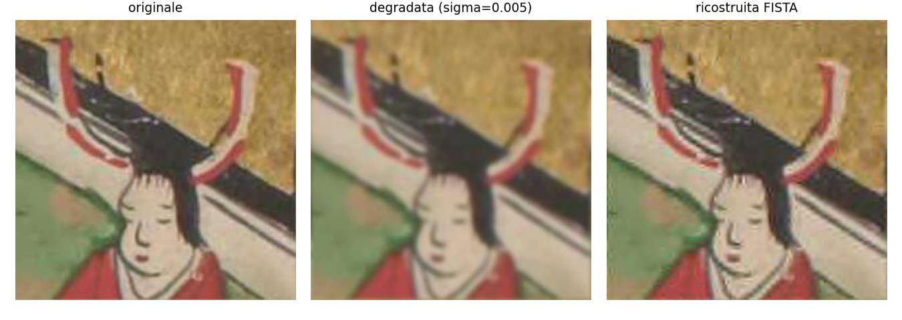
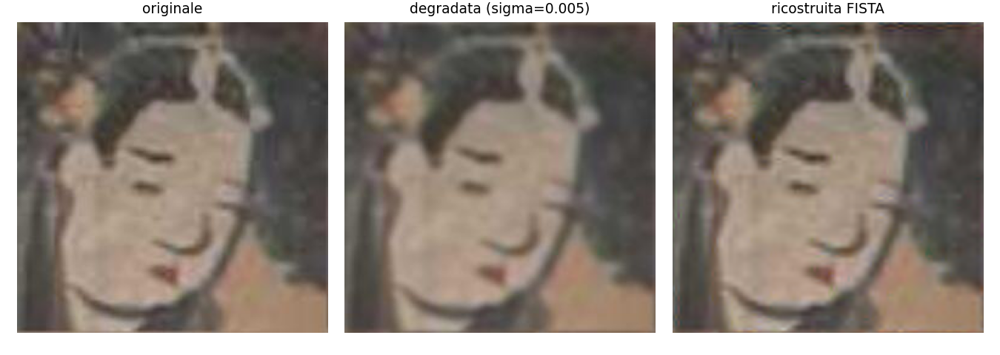
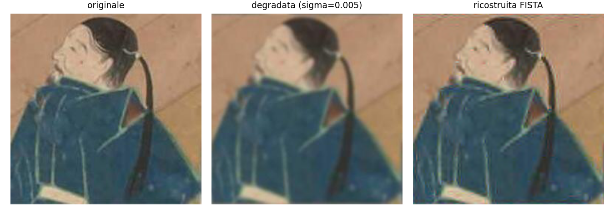

**sigma = 0.01**

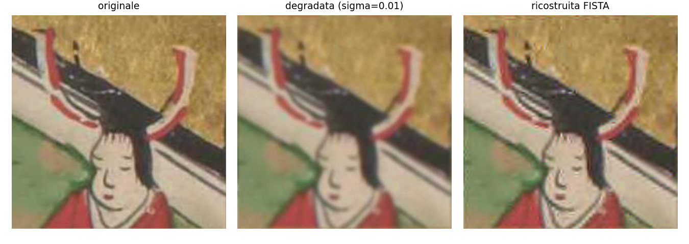

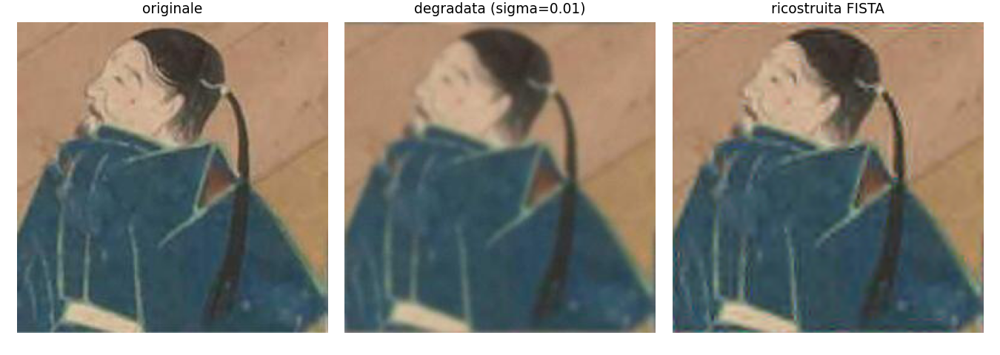

**sigma = 0.05**


**sigma = 0.1**


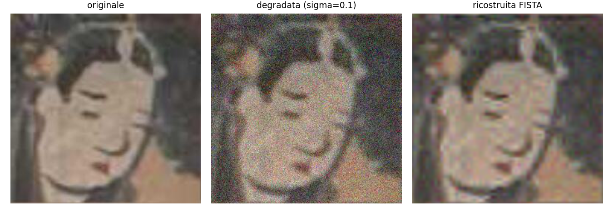


## 3. Metodo ibrido — PD-Net + TV

### Formulazione
Unrolling dell'algoritmo Primal-Dual di Chambolle-Pock per il problema TV-regolarizzato:

min_x  1/2||Ax-y||^2 + lambda*TV(x)

A differenza di un Learned Primal-Dual generico (dove il prior è appreso implicitamente
nello spazio dei dati), qui la variabile duale vive esplicitamente nello spazio del
gradiente dell'immagine (operatore `Gradient`, forward differences con aggiunto = divergenza
negata), il che lega la rete alla struttura TV richiesta dal testo invece che a un prior
generico non specificato. Ad ogni iterazione k:

```
Gx_bar = Gradient(x_bar)
p = p + DualNet_k([p, Gx_bar])

data_grad = A^T(A(x) - y)
GTp = Gradient.T(p)
x_new = x + PrimalNet_k([x, data_grad, GTp])

x_bar = x_new + (x_new - x)      # extrapolation, come nel Chambolle-Pock classico
x = x_new
```

Il gradiente del data-fidelity resta calcolato esattamente (fisica nota, non appresa). I
prossimali della TV hanno in realtà già una forma chiusa nota (il prossimale del dato è un
sistema lineare/passo di gradiente esplicito, quello del duale della TV è una proiezione
sulla palla l2 — è proprio per questo che Chambolle-Pock funziona su problemi TV): li sostituisco
comunque con piccole CNN (Conv3x3-LeakyReLU-Conv3x3, pesi indipendenti per ciascuna delle 8
iterazioni) non perché manchi una formula, ma per imparare dai dati un regolarizzatore più
espressivo della sola TV, mantenendo esatta la parte di fisica nota. Va notato anche che, nello
schema implementato, il termine dati è trattato con un gradiente esplicito (A^T(Ax-y)) anziché
con un passo prossimale esatto: è più propriamente uno schema alla Condat-Vu/PDHG con termine
liscio esplicito, imparentato con ma non identico al Chambolle-Pock puro citato come riferimento
teorico; il punto sostanziale (fisica nota fissa + correzione appresa) resta lo stesso.
Il numero di iterazioni (8) è stato scelto euristicamente, in linea con l'ordine di grandezza
usato nel paper originale di Adler & Öktem (Learned Primal-Dual), non da una grid search
esaustiva per vincoli di tempo.

### Training
4 modelli specializzati (uno per livello di rumore, stessa scelta fatta per UNet, vedi
sezione 4 per la motivazione), 1000 immagini training (sottoinsieme), degradazione generata
al volo ad ogni epoca, loss L1, Adam (lr=2e-4), 12 epoche, validazione sul dev set fisso con
salvataggio del checkpoint a PSNR migliore.

### Risultati sul test set (80 immagini)

| noise level (sigma) | PSNR medio (dB) | PSNR std | SSIM medio | SSIM std |
|---|---|---|---|---|
| 0.005 | 33.43 | 3.52 | 0.904 | 0.050 |
| 0.01  | 33.84 | 3.64 | 0.910 | 0.053 |
| 0.05  | 31.77 | 3.43 | 0.862 | 0.073 |
| 0.1   | 30.14 | 3.27 | 0.822 | 0.088 |

Tempo medio di ricostruzione: **0.0376 s/immagine** (singolo forward pass, GPU/MPS). Il modello
ha **69.700 parametri** (conteggio reale via `sum(p.numel() for p in model.parameters())`, non
la dimensione del file checkpoint), circa 120 volte meno degli **8.321.619** di UNet, pur
restando entro pochi decimi di dB dalla sua accuratezza — conseguenza diretta dell'aver
incorporato la fisica nota (operatori A e Gradient fissi, non appresi) direttamente
nell'architettura.

### Confronti visivi (originale | degradata | ricostruita PD-Net)

**sigma = 0.005**


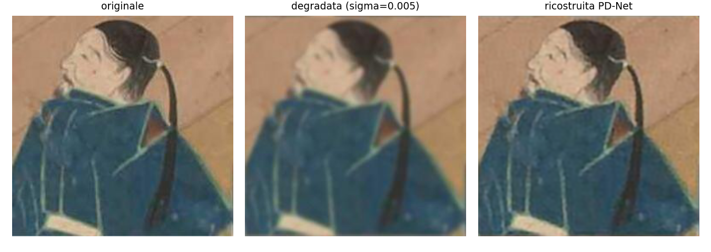

**sigma = 0.01**


**sigma = 0.05**


**sigma = 0.1**


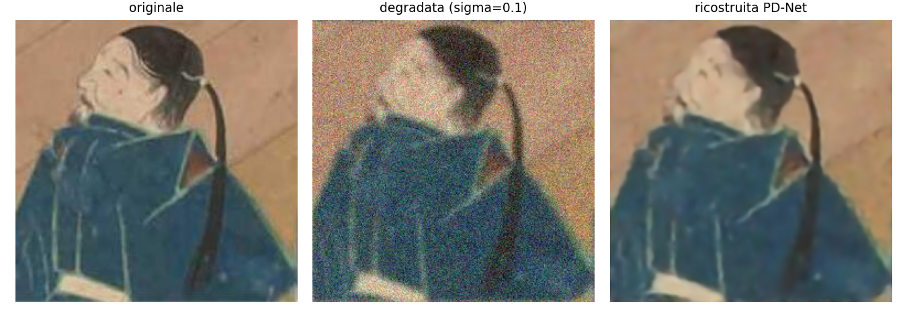

## 4. Metodo end-to-end — UNet

### Scelta dell'architettura
Tra UNet, ViT e NAF-Net (le tre opzioni ammesse dal testo), si è scelta UNet: il blur è
locale (kernel 9x9) e il rumore è per-pixel, quindi non serve catturare dipendenze a lungo
raggio come farebbe l'attention di un ViT (più utile per task con contesto globale, es.
inpainting di regioni ampie), e un ViT richiederebbe più dati/parametri per essere
competitivo. NAF-Net sarebbe stata una scelta valida ma più complessa da implementare
correttamente nel tempo disponibile. Le skip connection di UNet sono il meccanismo diretto
per un problema dove input e output condividono quasi tutta la struttura spaziale.

### Architettura
4 livelli di downsampling (MaxPool 2x2), canali base 48 (48-96-192-384 nel bottleneck a
16x16), blocco convoluzionale = 2x(Conv3x3 + GroupNorm + ReLU) per stadio, skip connection
per concatenazione. Apprendimento residuale: la rete produce x_hat = y + UNet(y), impara
solo la correzione da applicare all'osservazione invece di ricostruire l'immagine da zero
(pratica standard nelle reti di denoising, es. DnCNN).

### Training
4 modelli specializzati (uno per livello di rumore): per un confronto equo con FISTA, che
specializza necessariamente il parametro lambda per livello di rumore (principio di
discrepanza), si è scelto di dare anche ai metodi deep-learning lo stesso "budget di
specializzazione", invece di un solo modello blind generalista — così il confronto isola la
capacità di ciascun metodo di ottenere il miglior risultato possibile a un dato livello di
rumore, senza confondere questo con la capacità di generalizzare su più rumori
contemporaneamente. Questo richiede però un'assunzione da dichiarare esplicitamente: il livello
di rumore deve essere noto a tempo di test (si sceglie il checkpoint sapendo sigma in anticipo),
un'informazione laterale che un metodo davvero "blind" non avrebbe. 1000 immagini training,
degradazione al volo (rumore ridisegnato ad ogni epoca, blur sempre fisso), loss L1, Adam
(lr=2e-4), 20 epoche, validazione sul dev set fisso con salvataggio del checkpoint a PSNR
migliore.

Va notato che il budget di training di UNet (1000 immagini, 20 epoche) è più ampio di quello di
PD-Net (700 immagini, 12 epoche): non è quindi un confronto a parità assoluta di risorse, ma
una scelta pragmatica dettata dal tempo disponibile e dal costo per epoca diverso dei due
metodi. Questo, se mai, rafforza la lettura sull'efficienza di PD-Net (sezione 5): raggiunge
un'accuratezza comparabile con meno dati, meno epoche e 120 volte meno parametri.

### Risultati sul test set (80 immagini)

| noise level (sigma) | PSNR medio (dB) | PSNR std | SSIM medio | SSIM std |
|---|---|---|---|---|
| 0.005 | 33.39 | 3.51 | 0.903 | 0.049 |
| 0.01  | 34.03 | 3.73 | 0.913 | 0.052 |
| 0.05  | 32.08 | 3.44 | 0.872 | 0.069 |
| 0.1   | 30.49 | 3.26 | 0.836 | 0.080 |

Tempo medio di ricostruzione: **0.0373 s/immagine**.

### L'anomalia non monotona
Si osserva un andamento leggermente non monotono: il PSNR a sigma=0.005 è inferiore a quello a
sigma=0.01, il caso meno rumoroso va peggio. Vale la pena analizzarlo invece di limitarsi a
constatarlo. L'osservazione degradata è però quasi identica ai due livelli (baseline PSNR 29.86
vs 29.81 dB, sezione 1): il blur domina sul rumore in questo regime, quindi la difficoltà del
compito cambia pochissimo tra i due livelli — la causa non sta nei dati. FISTA, che non ha
training, è invece perfettamente monotona (31.17 → 31.00 → 28.96 → 27.09 dB): l'anomalia è
confinata ai metodi allenati, quindi è un effetto del training, non del problema.

Ipotesi, in ordine di plausibilità: (i) la selezione del checkpoint è fatta sul dev set, ma
piccolo (20 immagini), quindi la stima del PSNR di validazione è rumorosa; (ii) un solo run di
training per configurazione, senza media su più seed — gli eventuali errori non sono quindi
indipendenti tra le architetture quanto sembrerebbe; (iii) la loss L1 usata in training non è
perfettamente allineata con il PSNR (metrica L2), e il disallineamento può pesare di più quando
il residuo da correggere è piccolo. Non ci sono elementi per distinguere tra queste ipotesi con
i dati raccolti: servirebbero più run con seed diversi e model selection su un dev set più
ampio. Un esperimento mirato (riallenare solo il modello a sigma=0.005 con selezione più
accurata del checkpoint) è lasciato a lavoro futuro.

### Confronti visivi (originale | degradata | ricostruita UNet)

**sigma = 0.005**


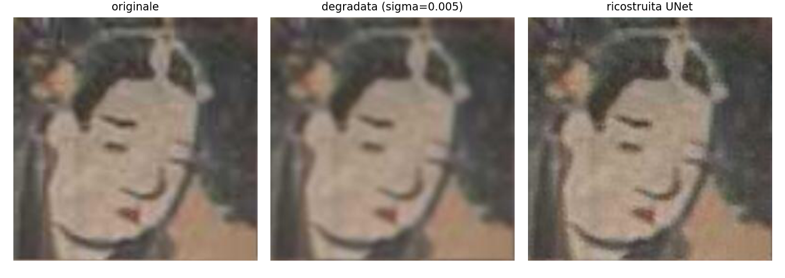


**sigma = 0.01**


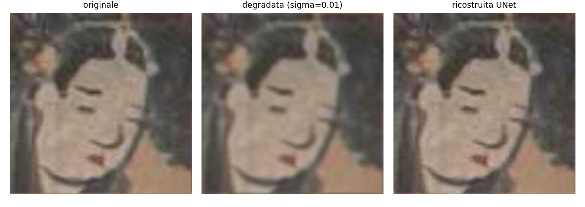
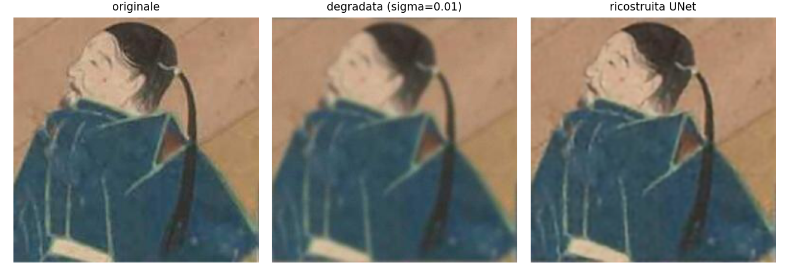

**sigma = 0.05**


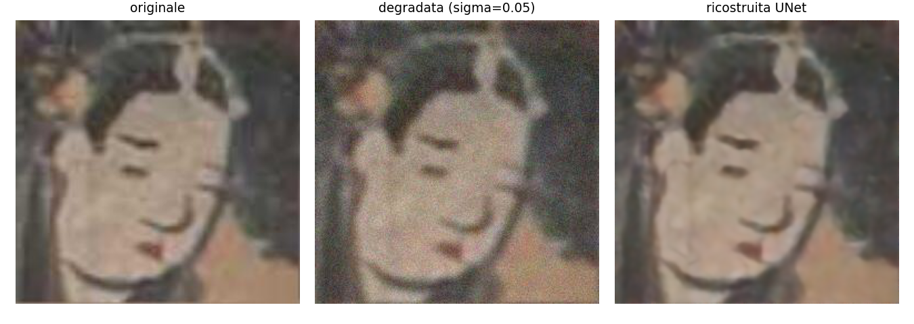
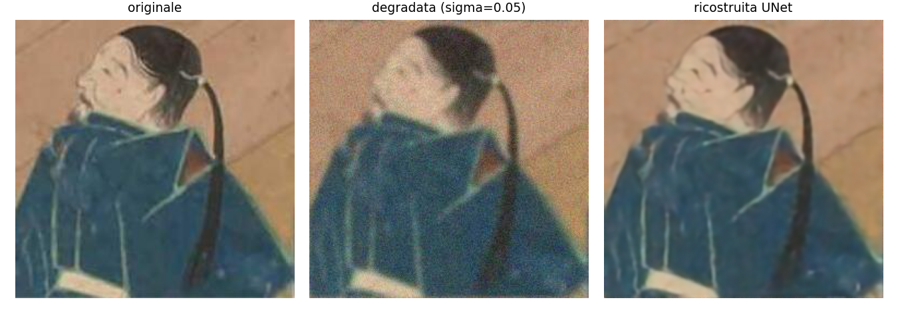

**sigma = 0.1**

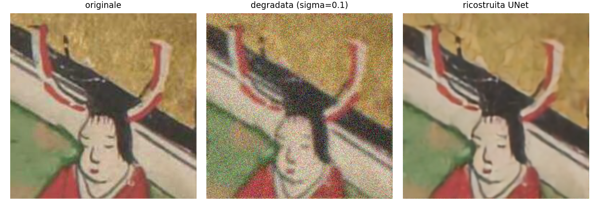

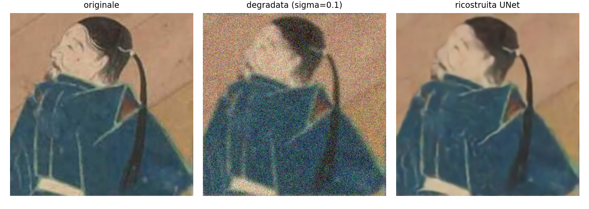

## 5. Confronto finale tra metodi

| Metodo | PSNR (range sui 4 livelli) | SSIM (range) | Tempo/immagine |
|---|---|---|---|
| FISTA-Wavelet | 27.09 - 31.17 dB | 0.699 - 0.861 | 1.572 s |
| PD-Net | 30.14 - 33.84 dB | 0.822 - 0.910 | 0.038 s |
| UNet | 30.49 - 34.03 dB | 0.836 - 0.913 | 0.037 s |

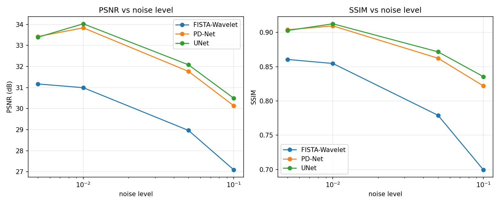

Il plot include anche la baseline (osservazione degradata, non ricostruita): mostra quanto
guadagna ciascun metodo rispetto al punto di partenza, e che il divario tra metodi appresi e
FISTA si allarga al crescere del rumore.

### Confronto statistico appaiato UNet vs PD-Net
Le due reti sono valutate sulle stesse identiche 80 immagini: il confronto corretto è quindi
appaiato (paired), non un confronto tra le deviazioni standard image-per-image (che riflettono
la variabilità tra immagini diverse, non l'incertezza sulla differenza tra i due metodi).
Calcolando le differenze PSNR per-immagine (UNet − PD-Net):

| noise level | differenza media (dB) | std delle differenze | t | UNet migliore in |
|---|---|---|---|---|
| 0.005 | -0.04 | 0.26 | -1.26 | 28/80 immagini |
| 0.01  | +0.17 | 0.23 | 6.32  | 68/80 immagini |
| 0.05  | +0.29 | 0.18 | 14.26 | 77/80 immagini |
| 0.1   | +0.39 | 0.17 | 20.94 | 79/80 immagini |

A sigma=0.005 le due reti sono statisticamente indistinguibili; ai tre livelli di rumore più
alti UNet è significativamente migliore (t grandi), ma con distacchi piccoli in valore assoluto
(0.17-0.39 dB). Il punto centrale del confronto non è quindi "chi vince", ma che PD-Net resta a
una frazione di dB da una rete 120 volte più grande e allenata con più dati/epoche.

### Discussione
UNet e PD-Net superano nettamente FISTA (2-3 dB di PSNR in più a ogni livello di rumore): un
metodo allenato specificamente sulla statistica del dataset KaoKore sfrutta un prior molto
più informativo di quello generico (sparsità wavelet) usato da FISTA, che è valido per
qualunque immagine naturale ma non specifico al dominio. Tra UNet e PD-Net, UNet è leggermente
avanti (vedi confronto appaiato sopra), ma PD-Net usa circa 120 volte meno parametri (69.700
contro 8.321.619): incorporare la fisica nota del problema (operatore di blur, struttura del
gradiente per la TV) direttamente nell'architettura riduce drasticamente cosa la rete deve
imparare da zero. FISTA è circa 40 volte più lento (100 iterazioni di ottimizzazione per
immagine, contro un singolo forward pass delle reti) — nota metodologica: FISTA è stato
eseguito su CPU, UNet e PD-Net in inferenza su GPU (MPS), quindi questo confronto di velocità è
indicativo, non a parità di hardware — ma è l'unico dei tre metodi che non richiede alcuna fase
di training ed è interamente interpretabile (ogni passo dell'algoritmo ha un significato
matematico esplicito). Il trade-off complessivo: FISTA offre interpretabilità e zero costo di
training a scapito di qualità e velocità; UNet massimizza la qualità a scapito del numero di
parametri; PD-Net rappresenta il miglior compromesso tra i tre, restando entro pochi decimi di
dB da UNet con una frazione dei parametri e dei dati di training, grazie all'impalcatura fisica
esplicita.

### Limiti e assunzioni dello studio
- **Scope ridotto per vincoli di tempo**: valutazione su un sottoinsieme fisso (80 immagini
  test, 20 dev) invece del test set completo (926 immagini); training set ridotto (700-1000
  immagini) e numero di epoche limitato (20 per UNet, 12 per PD-Net) rispetto a quanto si
  userebbe con risorse computazionali illimitate. Scelte dichiarate esplicitamente, non
  nascoste nei numeri.
- **Budget di training non identico tra UNet e PD-Net** (1000/20 vs 700/12): non è un confronto
  a parità assoluta di risorse; rafforza comunque, se mai, la tesi sull'efficienza di PD-Net.
- **Inverse crime (lieve)**: lo stesso identico operatore A usato per generare i dati degradati
  è anche quello usato dentro FISTA e PD-Net per ricostruire. È una semplificazione prevista e
  discussa nel corso, ma va dichiarata esplicitamente: con un A leggermente diverso da quello
  reale (kernel stimato con errore, per esempio), le prestazioni di entrambi i metodi
  peggiorerebbero.
- **Sfocatura intrinseca del dataset**: le immagini KaoKore sono ritagli di dipinti storici
  ridimensionati a 256x256 — la "ground truth" usata come riferimento non è perfettamente
  nitida in partenza, un limite del dataset più che dei metodi confrontati.
- **Assunzione del rumore noto a test time**: i 4 modelli specializzati (uno per livello)
  richiedono di sapere sigma in anticipo per scegliere il checkpoint giusto — un'informazione
  laterale che un metodo "blind" non avrebbe (vedi sezione 4).
- **Curve di validazione per epoca non salvate** durante il training su Colab: non è possibile
  verificare a posteriori se un modello avesse già raggiunto un plateau (rilevante per
  l'anomalia non monotona discussata in sezione 4).
